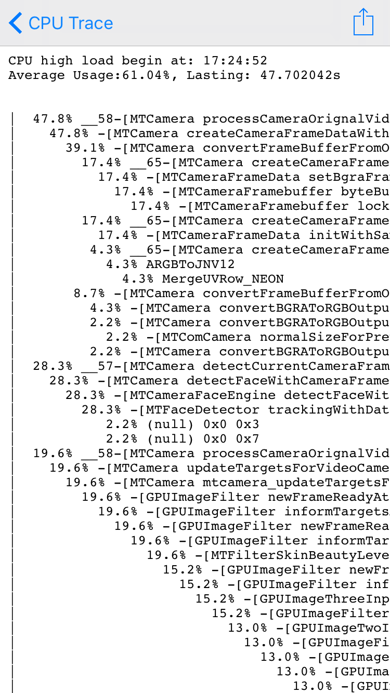

# Hawkeye - CPU Trace

`CPUTrace` is used to track the CPU's continuous high-load usage, and will recording which methods are mainly called during the high-load CPU usage.

## 0x00 Usage

After add `ANR Trace` to `MTHawkeyeClient`, by default it'll start after `MTHawkeyeClient` run, you can change it by following steps:

1. Tap MTHawkeye floating window, enter the main panel.
2. Tap navigation title view, show the MTHawkeye panel switching view.
3. Tap `Setting` in the upper right corner of the switching view, enter the Setting view home.
4. Find `Energy` and go to `CPU Trace`, turn off `CPU Trace`

The data recorded by `CPU Trace` contains following parts:

- CPU high-load start time
- CPU high-load duration
- Average CPU usage during the high-load.
- stack frame samples during the high-load.



## 0x01 Storage

While the records generate, the data will store under [Records file](./../hawkeye-storage.md#0x02-built-in-plugin-data-storage-instructions).

Each CPU high-load record split into two lines, one for the underlying data, and the `collection` name is `cpu-highload`

```md
cpu-highload,575204521.78,{{basic-cpu-highload record}}
```

`key` is the start time of the CPU high-load record, `{{basic-cpu-highload record}}` is a JSON string with three fields:

```json
{
    "start": "575204521.78", // the start time of the record
    "lasting": "132.60",     // the duration of the record
    "average": "106"         // the average CPU usage during the high-load, 106%
}
```

Another line records the sample stack frames during the high-load, the collection name is `cpu-highload-stackframe`.

```md
cpu-highload-stackframe,575204521.78,{{cpu-highload stackframes samples}}
```

`key` is the start time of the CPU high-load record, `{{cpu-highload stackframes samples}}` is a JSON string with fields bellow:

- `frame`: the frame from the sample call stack.
- `proportion`:  the ratio of this sample to the total sample
- `count`: the count the frame was sampled.
- `children`: sub-call frames

example

```json
[
    {
        "frame": "0x10234235",
        "proportion": 0.6,
        "count": 60,
        "children": [
            {
                "frame": "0x10234444",
                "proportion": 0.4,
                "count": 40
            },
            {
                "frame": "0x10235555",
                "proportion": 0.2,
                "count": 20
            }
        ]
    },
    {
        "frame": "0x10234111",
        "proportion": 0.3,
        "count": 30,
        "children": [
            {
                "frame": "0x10234112",
                "proportion": 0.3,
                "count": 30
            }
        ]
    },
    {
        "frame": "0x10234000",
        "proportion": 0.1,
        "count": 10
    }
]
```

You need to read both `cpu-highload` and `cpu-highload-stackframe` at the same time, After read out from the `Records file`, merge the records with the same key together.

## 0x03 Symbolics

`CPU Trace` records raw stack frame need to symbolized for reading.

If the running App do have DWARF within, you can directly use `CPU Trace` panel to view the symbolized result generated internal.

In other cases, if you have your own [remote symbolization service](./../hawkeye-remote-symbolics.md) and did set, switch on the `Remote Symbolics`, and then you can view the symbolized stack frame directly in the App.

If you wanna get the raw data from the sandbox, manual symbolize yourself as follows:

1. Get the `dyld-images` file in the MTHawkeye storage directory.
2. Get the raw stack frame data from the records.
3. Get the `dSYM` files
4. for each `frame`
    - find the match `dyld-image` by `frame` value, then match a `dSYM` file.
    - Use `atos` command to symbolize the `frame`.

## 0x04 Performance Impact

The main time-consuming point is to get the CPU usage detail of all threads and sampling the stacks while CPU high-load.

Under iPhone 6s, iOS 10.3.2, while there are about 30 threads running, the original CPU usage is 90~110%, and the number of threads that need to be sampling stacks is less than 5.

- For RELEASE, cost 350us to get all the CPU usage detail each time in average. Under DEBUG is not much different.
- For RELEASE, cost 160us to sampling the call stacks in average. And about 290us under DEBUG.

In summary, the extra time spent in each operation is within 1 millisecond, while the default trigger interval to get the usage is once per second, and when during high-load it's every 0.3 seconds.
