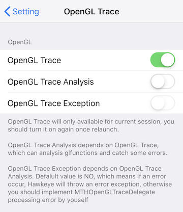

# Hawkeye - OpenGL Trace

`OpenGL Trace` 通过 Hook 平台上 `OpenGL` 相关接口实现对 `OpenGL` 分配、释放资源的监控，方便排查是否存在 `OpenGL` 相关资源的泄漏，同时还提供常见的 `OpenGL` 逻辑操作检测。

## 0x00 背景

`OpenGL` 渲染引擎在调试上十分不方便，尽管 Xcode 提供了 Frame Capture 的 OpenGL ES 调试工具让我们可以在开发过程中调试每一帧图像绘制流程，但是对于运行过程中的资源泄漏很难排查。

为此 `OpenGL Trace` 借助 [FishHook](https://github.com/facebook/fishhook) Hook 了 iOS 平台上 `OpenGL ES` 和部分 `CoreVideo` 的函数，实现对 `Texture/Program` 等资源的监控。

## 0x01 使用

`OpenGL Trace` 加入到 MTHawkeyeClient 中默认关闭，在需要使用时，需要手动开启：

1. 启动 App 后，点击 Hawkeye 的浮窗进入主面板
2. 点击导航栏 title，呼出 Hawkeye 面板切换界面
3. 点击切换界面右上角的 `Setting`，进入 Hawkeye 设置主界面
4. 找到 `OpenGL Trace` 进入详情页
    * 开启 `OpenGL Trace`, 跟踪 GL 相关资源占用
    * 开启 `Analysis`（需要先开启 `OpenGL Trace`），跟踪 OpenGL API 调用异常
    * 开启 `Raise Exception Enabled`（需要先开启 Analysis)，有侦测到异常时直接断言

### OpenGL 资源内存占用跟踪

在开启 `OpenGL Trace` 功能后在模块的主界面可以看到目前跟踪存活的 OpenGL 资源对象，目前主要包括以下的资源对象：

* 纹理（Texture）
* 渲染管线（Program）
* 帧缓冲（FrameBuffer）
* 渲染帧缓冲（RenderBuffer）

主界面默认展示当前依然存活的 OpenGL 资源对象。

还可以选定两个时间点（进入前、退出后），查看一个页面分配的相关资源到是否已经释放。如下方右图 16:57:01.577 左右某个页面创建了一张 389*451 大小的纹理对象到切入监控界面的时候依然存在，根据选中的区间大致可知道这张纹理资源在第三个页面中被创建。

### OpenGL 常见错误调用与参数异常跟踪

当开启 `OpenGL Trace` 和 `OpenGL Trace Analysis` 功能后会开始进行常见 OpenGL 调用逻辑和参数进行跟踪，目前包含以下侦测策略：

* 访问一个在任意上下文中从未被创建过的资源句柄
* 访问一个当前上下文已经被删除的资源句柄
* 逻辑上删除了另一个上下文的资源句柄，当两个上下文非共享时纹理句柄可能是一样的。
* 跨上下文访问资源句柄
* 未在GL上下文（上下文为空）调用GL函数
* 纹理对象大小为0

当在**开发阶段**有以上异常调用逻辑的时候会抛出上诉异常信息，在开启 `Raise Exception Enabled` 时，这些信息会以异常的形式抛出。上层也可以关闭这个开关，实现 `MTHOpenGLTraceDelegate` 协议里的 `glTracer:didReceivedErrorMsg:` 方法，来处理异常信息。

## 0x02 存储说明

接入到 HawkeyeClient 且没被关闭的情况下，`OpenGLTrace` 若有监测到 OpenGL 资源内存变化，会将数值会存储到 [Records 文件](./../hawkeye-storage-cn.md#0x02-内置插件存储数据说明)，`collection` 为 `gl-mem`, `key` 为记录的时间点，`value` 为 OpenGL 资源占用值，单位为 MB。监听的间隔时间默认为 0.5s, 如果有空缺，是因为数据没变化省略记录。
