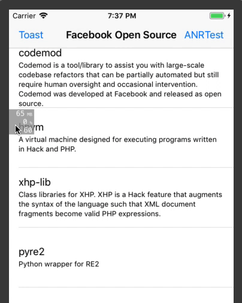
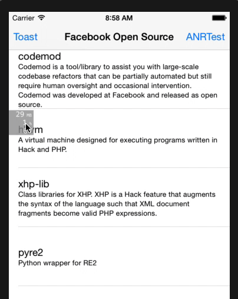

# MTHawkeye Plugin Development Guide

When do I need a profiling/debugging assist plugin?

If you have a module that needs to avoid a lot of pits during development, or if you have a lot of debugging/optimization related logging code during development, consider writing a debugging aid and then importing this component into MTHawkeye based on the MTHawkeye API. Used in the framework to unify interactions and interfaces.

If the performance metrics you care about are not continuously tracked during automated testing, consider writing a profiling plugin to collect performance data.

## 0x00 Component of a MTHawkeye Plugin

When a module is adapted to MTHawkeye, in addition to the main body, it can be divided into two parts. The base part is responsible for basic scheduling and use the capabilities provided by `MTHawkeye/Core`:

- plug-in switch
- storage layer
- stack backtrace and stack frame symbolization

The other part is responsible for interface interaction, using the interface skeleton provided by `MTHawkeye/UISkeleton`:

- Display current summary information (such as MEM, CPU, FPS) in MTHawkeye floating window.
- Quickly set up a unified settings interface.
- Quickly build a unified plug-in main interface.
- Flash warning on floating window widget, jump to the corresponding main panel when clicked.
- MTToast can be used to inform developers of problems discovered during development.

To use MTHawkeye's scheduling and capabilities in `MTHawkeye/Core`, you need to implement `MTHawkeyePlugin` below.

To use MTHawkeye's interface interaction framework, you need to choose and implement `MTHawkeyeMainPanelPlugin`, `MTHawkeyeFloatingWidgetPlugin`, `MTHawkeyeSettingUIPlugin`.

For example, the built-in `ANRTrace` plugin for tracing ANR events.

- the base layer, `ANRTrace/Core` only responsible for capturing ANR events.
- the upper, `ANRTrace/HawkeyeCore` is an adaptation layer, stores captured events.
- the top layer, `ANRTrace/HawkeyeUI` is interface layer, implemented to view the recorded events, flash warning on the floating window of MTHawkeye when ANR is captured, and setting interface based on `MTHawkeye/UISkeleton`.

here is the ANRTrace subspec in MTHawkeye.podspec which shows the dependencies.

```ruby
    tc.subspec 'ANRTrace' do |anr|
      anr.subspec 'Core' do |core|
        core.public_header_files = 'MTHawkeye/TimeConsumingPlugins/ANRTrace/Core/*.{h}'
        core.source_files = 'MTHawkeye/TimeConsumingPlugins/ANRTrace/Core/*.{h,m}'
        core.dependency 'MTHawkeye/Utils'
        core.dependency 'MTHawkeye/StackBacktrace'
      end

      anr.subspec 'HawkeyeCore' do |hc|  #
        hc.public_header_files = 'MTHawkeye/TimeConsumingPlugins/ANRTrace/HawkeyeCore/*.{h}'
        hc.source_files = 'MTHawkeye/TimeConsumingPlugins/ANRTrace/HawkeyeCore/*.{h,m}'
        hc.dependency 'MTHawkeye/Core'
        hc.dependency 'MTHawkeye/TimeConsumingPlugins/ANRTrace/Core'
      end

      anr.subspec 'HawkeyeUI' do |ui|
        ui.public_header_files = 'MTHawkeye/TimeConsumingPlugins/ANRTrace/HawkeyeUI/*.{h}'
        ui.source_files = 'MTHawkeye/TimeConsumingPlugins/ANRTrace/HawkeyeUI/*.{h,m,mm}'
        ui.dependency 'MTHawkeye/Core'
        ui.dependency 'MTHawkeye/UISkeleton'
        ui.dependency 'MTHawkeye/TimeConsumingPlugins/ANRTrace/HawkeyeCore'
      end
    end
```

## 0x01 Plugin Protocol

### 01. Implement `MTHawkeyePlugin` protocol to access MTHawkeye scheduling

```objc
@protocol MTHawkeyePlugin <NSObject>

@required
+ (NSString *)pluginID;
- (void)hawkeyeClientDidStart
- (void)hawkeyeClientDidStop;

@optional
- (void)receivedFlushStatusCommand;
@end
```

1. According to `MTHawkeyePlugin` protocol
  a. Implement the `+ (NSString *)pluginID` method, will be needed when using `[MTHawkeyeClient pluginFromID]`.
  b. Implement `- (void)hawkeyeClientDidStart` and `- (void)hawkeyeClientDidStop`, handle your plugin's switching logic.

    while hawkeyeClient did start or stop, whether your plugin should start or stop is determined by yourself. For example, some plugins may need to be started earlier.

  c. If you need to keep track of the application or system state, consider implementing the `-(void)receivedFlushStatusCommand` method instead of create a new timer.
2. When setup MTHawkeyeClient by invoking `-[MTHawkeyeClient setupPluginsSetup:pluginsCenter:]`, using pluginsSetupHandler to add your created plugin object to MTHawkeyeClient. Sample code is at the end of this article.

> Plugin API details can be found in the `MTHawkeye/Core/MTHawkeyePlugin.h` file.

### 02. Implementing interface for the plugin and add it into MTHawkeyeUIClient

`MTHawkeyeUIClient` contains three parts of interface modules that can be inserted externally as a plugin, here are the bridge protocols.

- `MTHawkeyeFloatingWidgetPlugin`, bridge to display summary state on MTHawkeye floating window.
- `MTHawkeyeMainPanelPlugin`, bridge to expose your plugin's main interface under MTHawkeye.
- `MTHawkeyeSettingUIPlugin`, bridge to add settings view for your plugin under MTHawkeye.

The above protocol can be implemented according to the actual needs of the plug-in. The final created object is added to the MTHawkeyeUIClient to complete the interface layer bridging.

#### A. Display summary infos on MTHawkeyeUIClient floating window

`MTHawkeyeUIClient` will display a floating window by default after startup. You can implement `MTHawkeyeFloatingWidgetPlugin` protocol, and then create a widget plugin, added to this floating window to display current status information(such as memory, CPU, FPS, critical event).

```objc
@protocol MTHawkeyeFloatingWidgetDisplaySwitcherPlugin <NSObject>
@optional
- (MTHawkeyeSettingSwitcherCellEntity *)floatingWidgetSwitcher;
@end

@protocol MTHawkeyeFloatingWidgetPlugin <MTHawkeyeFloatingWidgetDisplaySwitcherPlugin>

@required
@property (nonatomic, weak) id<MTHawkeyeFloatingWidgetDelegate> delegate;

@required
- (NSString *)widgetIdentity;
- (MTHMonitorViewCell *)widget;
- (BOOL)widgetHidden;

@optional
- (void)receivedFlushStatusCommand;
- (void)receivedRaiseWarningCommand:(NSDictionary *)params;

@end
```

1. `- (NSString *)widgetIdentity` is for distinguish widget from others.
2. Drawing your own widget by implementation `- (MTHMonitorViewCell *)widget` and a `MTHMonitorViewCell`.
3. If you need to update the status display regularly, refresh `MTHMonitorViewCell` under `- (void)receivedFlushStatusCommand`
4. If you want to support warning on `MTHMonitorViewCell`, implement `- (void)receivedRaiseWarningCommand:(NSDictionary *)params` and configure your own warning style. (eg: FPS warning)
5. If you want to hide your widget during the run, call `floatingWidgetWantHidden:` method of `id<MTHawkeyeFloatingWidgetPlugin>.delegate`

Example can refer to the built-in plugin `MTFPSHawkeyeUI`.

#### B. Bridge your plugin's main panel to MTHawkeyeUIClient

When top on the floating window, it will jump to the main interface. By default, the plugin that was last viewed will be displayed, tap the title to switch between different plugin panels (as shown below).

, 

These plugins are integrated by implementing the `MTHawkeyeMainPanelPlugin` protocol to link there interface to MTHawkeyeUIClient.

```objc
@protocol MTHawkeyeMainPanelPlugin <NSObject>

@required

- (NSString *)switchingOptionTitle;
- (NSString *)groupNameSwitchingOptionUnder;

@optional

- (NSString *)mainPanelTitle;

- (UIViewController *)mainPanelViewController;
- (NSString *)mainPanelIdentity;

- (BOOL)switchingOptionTriggerCustomAction;
- (void)switchingOptionDidTapped;

@end
```

1. `- (NSString *)switchingOptionTitle`, the entry title of the plugin. (eg. ANR Records, UI Time Profiler)
2. `- (NSString *)groupNameSwitchingOptionUnder`, the group which the plugin belongs on the switcher. (eg. Memory, Energy)
3. There are two different behaviors when tap the switching option.
    - To show the plugin's main panel under MTHawkeyeUIClient's main view, implement the following method.
        - `- (UIViewController *)mainPanelViewController`, the main panel of the plugin, will use as an childViewController under MTHawkeyeUIClient.
        - `- (NSString *)mainPanelIdentity`, unique id of the main panel.
        - `- (NSString *)mainPanelTitle`, optional, if not implemented, use the title returned by `switchingOptionTitle`.

    - To do custom action without show panel under MTHawkeyeUIClient's main view. (eg. FLEX plugins show FLEX window by itself)
        - `- (BOOL)switchingOptionTriggerCustomAction` return `YES`.
        - implement `- (void)switchingOptionDidTapped`.

#### C. Add your plugin's setting interface under MTHawkeyeUIClient

It's recommended to add necessary settings view for your plugin.

 

In addition to the first TableView section, the setting in the screenshot is added by implementing `MTHawkeyeSettingUIPlugin` protocol. The added setting items are grouped by section name, for example, `Living Object Sniffer` and `Allocation` are from two plugins and grouped by name `Memory` provided by `+ (NSString *)sectionNameSettingsUnder`.

```objc
@protocol MTHawkeyeSettingUIPlugin <NSObject>

@required
+ (NSString *)sectionNameSettingsUnder;
+ (MTHawkeyeSettingCellEntity *)settings;

@end
```

- `+ (NSString *)sectionNameSettingsUnder`, which setting group should the plugin under in setting home.
- `+ (MTHawkeyeSettingCellEntity *)settings`, the settings entity root of the plugin, with following types.
  - `MTHawkeyeSettingFoldedCellEntity`, setting entity that are folded, used as an entry of most plugins.
  - `MTHawkeyeSettingEditorCellEntity`, editable setting cell entity.
  - `MTHawkeyeSettingSwitcherCellEntity`, switcher setting cell entity.
  - `MTHawkeyeSettingActionCellEntity`, custom action setting cell entity.

Generally, a cell of type `MTHawkeyeSettingFoldedCellEntity` is return from `+ (MTHawkeyeSettingCellEntity *)settings`, and the actual settings entity items are placed inside the folded cell, with a `DisclosureIndicator` cell style to guide to the detail.

## 0x02 Add plugins

Start MTHawkeye manually, use setupHandler to add default plugins and your plugins.

```objc
  [[MTHawkeyeClient shared]
    setPluginsSetupHandler:^(NSMutableArray<id<MTHawkeyePlugin>> *_Nonnull plugins) {
      [MTHawkeyeDefaultPlugins addDefaultClientPluginsInto:plugins];

      // add your additional plugins here.
    }
    pluginsCleanHandler:^(NSMutableArray<id<MTHawkeyePlugin>> *_Nonnull plugins) {
      // if you don't want to free plugins memory, remove this line.
      [MTHawkeyeDefaultPlugins cleanDefaultClientPluginsFrom:plugins];

      // clean your additional plugins if need.
    }];

  [[MTHawkeyeClient shared] startServer];

  [[MTHawkeyeUIClient shared]
    setPluginsSetupHandler:^(NSMutableArray<id<MTHawkeyeMainPanelPlugin>> *_Nonnull mainPanelPlugins, NSMutableArray<id<MTHawkeyeFloatingWidgetPlugin>> *_Nonnull floatingWidgetPlugins, NSMutableArray<id<MTHawkeyeSettingUIPlugin>> *_Nonnull defaultSettingUIPluginsInto) {
      [MTHawkeyeDefaultPlugins addDefaultUIClientMainPanelPluginsInto:mainPanelPlugins
                                    defaultFloatingWidgetsPluginsInto:floatingWidgetPlugins
                                          defaultSettingUIPluginsInto:defaultSettingUIPluginsInto];


        // add your additional plugins here.
    }
    pluginsCleanHandler:^(NSMutableArray<id<MTHawkeyeMainPanelPlugin>> *_Nonnull mainPanelPlugins, NSMutableArray<id<MTHawkeyeFloatingWidgetPlugin>> *_Nonnull floatingWidgetPlugins,NSMutableArray<id<MTHawkeyeSettingUIPlugin>> *_Nonnull defaultSettingUIPluginsInto) {
      // if you don't want to free plugins memory, remove this line.
      [MTHawkeyeDefaultPlugins cleanDefaultUIClientMainPanelPluginsFrom:mainPanelPlugins
                                      defaultFloatingWidgetsPluginsFrom:floatingWidgetPlugins
                                            defaultSettingUIPluginsFrom:defaultSettingUIPluginsInto];

      // clean your additional plugins if need.
    }];

  dispatch_async(dispatch_get_main_queue(), ^(void) {
    [[MTHawkeyeUIClient shared] startServer];
  });
```

The `setupHandler` block will be invoked when the client **starting**, add these plugins to client and then invoked method `hawkeyeClientDidStart` on them.

The `cleanHandler` block will be invoked when the client **stopping**, you can do plugin memory reclaim here, see how MTHawkeyeDefaultPlugins do for detail.
