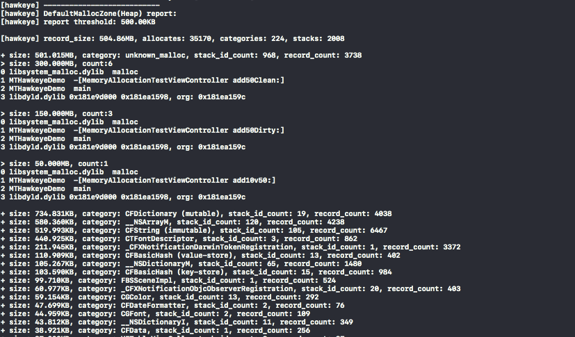
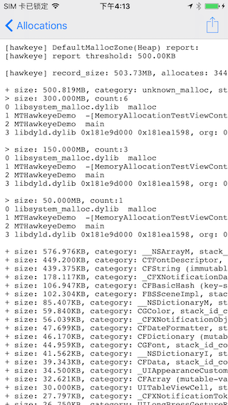

# Hawkeye - Allocations

`Allocations` is similar to Instrument's Allocations module, It tracks the memory details actually allocated by the application. When the application memory usage is abnormal (abnormal rise, OOM exit), the recorded memory allocation details can be used to analyze specific memory usage issues.

## 0x00 Background

After publishing our App, we will found that it's difficult for us to handle the OOM cause we can't get the detail of the memory allocations. Tencent had post articles about OOM like [iOS 爆内存问题解决方案](https://juejin.im/post/5a58f1a76fb9a01cab283392), [iOS 微信内存监控](https://mp.weixin.qq.com/s?__biz=MzA3NjA3NTI5Mg==&mid=2656330237&idx=1&sn=30f0ef983229766db955f7f513ea2872&chksm=84c6198eb3b1909869b343e1ac2cfa46a64e8b7b72e47d7ee72282ea855ae124afce999bf16a&mpshare=1&scene=1&srcid=03012ZuanPME6WqDfHRsGgKC&rd2werd=1#wechat_redirect), and publish two open-source components, which is [Tencent - OOMDetector](https://github.com/Tencent/OOMDetector) and [WeChat - Matrix](https://github.com/Tencent/matrix).

Before we build our own `Allocations`, the `Matrix` is still private, and `OOMDetector` is less usable in a real projects, so we build our own `Allocations`.

It's not only for production environments, but also for development and test environments.

In the development stage, if you encounter some abnormal memory usage, you can quickly see the detail memory allocations by simply turn on the switch and repeat the last run actions.

While in test or production environments, when the switch is on and abnormal exit due to OOM, the allocations records can be read from the sandbox. With the records, it'll be able to do further analysis and optimize memory usage.

## 0x01 Usage

After add `Allocations` to MTHawkeyeClient, it's closed by default, you can open and configure it by following steps:

1. Tap MTHawkeye floating window, enter the main panel.
2. Tap navigation title view, show the MTHawkeye panel switching view.
3. Tap `Setting` in the upper right corner of the switching view, enter the Setting view home.
4. Find `Memory` and go to `Allocations`
    - Turn on `Trace Heap & VM Allocations`.
    - Relaunch, repeat the last run actions.
    - Go to `Allocations` view, Under `Running Session`, check the recorded allocations.
    - For report configuration, see [Report Configuration](#0x03-report-configuration)

## 0x02 View the Report

When the `Allocations` is on, there are several ways to view the record report.

1. Under Xcode debugging

Under `Running Session` in `Allocations` view, select `Dump Allocations to console in line`, will read the records, generate report and dump to Xcode console. An example as follow:

2. View report within the App

- Select `Dump Allocations to file in line`, will read out records, generate report and format it in line. (Detailed description later)
- Select `Dump Allocations to file in JSON`, will read out records, generate report and format it in JSON string. (Detailed description later)

3. View history session reports

Under `History Sessions`, select the specific session. (only when the Allocations is ON for that session).

4. Export records

export the records under directory `com.meitu.hawkeye/****the-session-time****/allocations/` in sandbox, generally contains the following files:

- `malloc_records_raw`, memory allocate by `malloc` and not yet `free`.
- `vm_records_raw`, memory allocate by `vmallocate`/`mmap` and not yet `free`.
- `stacks_records_raw`, the stack frame records when allocate memory.
- `dyld-images`, use for further stack frame symbolics.
- `malloc_report`, only exist after `Dump Allocations to file in JSON`, can also be generated by `MTHAllocationsReader`.
- `vm_report`, only exist after `Dump Allocations to file in JSON`, can also be generated by `MTHAllocationsReader`.

After get the record files, you need to generate a readable report based on the three `**_records_raw` and `dyld-images` files. In the repository, you can get the command line tool `MTHAllocationsReader` under directory `MTHAllocationsReader/bin/` to parse the raw records and generate a report. see [MTHAllocationsReader command description](./allocations-raw-record-reader.md) for detail.

### Report Description

#### JSON format report

- "stack_record_count", the total count of unique stack frame recorded when allocate memory.
- "threshold_in_bytes", only when the living memory exceed the threshold by that allocate stack, that stack will be output to the report. (see `stacks` object below)
- "category_record_count": the total count of unique categories.
- "total_size": total living memory recorded, in bytes.
- "categories": allocated memory group by category.
  - "name", the category name. would be Objective-C class name if the memory is allocate by OC class. (eg. MALLOC, UIView, NSObject)
  - "stack_id_count", the total count of unique stack frame recorded under that category.
  - "size", total living memory recorded under that category, in bytes.
  - "record_count", total count of memory pointers not freed yet under that category.
  - "stacks", the living memory allocated by these stacks exceeds the `threshold_in_bytes`.
    - "frames", memory allocation stack frame. For symbolics, see [Report Configuration - Remote symbolics](#0x03-report-configuration)
  	- "size", total living memory recorded under that allocate stack, in bytes
  	- "count", total living memory pointers count under that allocate stack

[Demo report in JSON format](./allocations-report-in-json-demo.txt)

#### Line format report

The fields is the same as the JSON format before, output in the form of lines for readability.

[Demo report in lines format](./allocations-report-in-lines-demo.txt)

## 0x03 Report Configuration

You can change the report configuration to control the report details.

- `Heap Report Threshold`

`Heap Report Threshold` is used to control whether we should show the stack frame in the report for the malloc stack. For the default threshold 500KB, it means that only when a malloc stack has allocate memory exceed 500KB and has not been freed yet, the malloc stack frame will be output to the `malloc_report` file. For the stack only allocate a small memory, we only output the size and pointer count, the stack frame are ignored.

- `VM Report Threshold`

Similar to `Heap Report Threshold`, but not for `malloc`, for `vm_allocate`/`mmap`, will output to `vm_report` file.

- `Category Report Threshold`

Filter the category in the report, when the category's living count of pointer is less than the threshold, it would output to the report. Default value is 0, which means will output all the categories to the report.

- `Remote symbolics`

If the running App do have DWARF within, without turn on `Remote symbolics`, you can directly use `Allocations` panel to view the symbolized result generated internal.

In other cases, if you have your own [remote symbolization service](./../hawkeye-remote-symbolics.md) and did set, turn on the `Remote Symbolics`, and then you can view the symbolized stack frame directly in the App.

If you wanna get the raw data from the sandbox, manual symbolize yourself as follows:

1. Get the `dyld-images` file in the MTHawkeye storage directory.
2. Get the raw stack frame data from the records.
3. Get the `dSYM` files
4. for each `frame`
    - find the match `dyld-image` by `frame` value, then match a `dSYM` file.
    - Use `atos` command to symbolize the `frame`.

## 0x04 Performance Impact

Under iPhone 7, iOS 12.2, enter the Meitu camera interface, after turn on `Allocations`, the average CPU usage will increate by about 5%, and occupying 12MB mmap memory internal.
