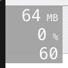
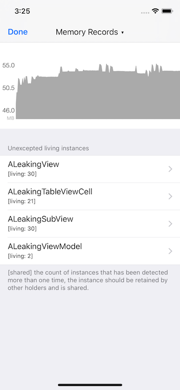

# Hawkeye - Living Objects Sniffer

`LivingObjectSniffer` is mainly used to track and observe objects directly or indirectly held by ViewController, as well as custom View objects. Detects whether these objects are unexpected alive, which may cause by leaks, not released in time, or unnecessary memory buffers.

In the development and testing phase, the detected unexpected alive objects can be prompted to developer in the form of floating windows flash warning or toast.

In the automated test, the recorded unexpected alive objects can also be extracted for further memory usage analysis.

## 0x00 Background

We may use several tools to help troubleshoot memory leaks, such as:

1. `Xcode+Instrument`, the main disadvantage is that it's a little heavy, and result is that we'll use it until the final stage of a development cycle.

2. `FBMemoryProfiler`, tools from Facebook, `FBAllocationTracker` will tracking all the living ObjC objects, and `FBRetainCycleDetecter` is used to find out retain cycle.

3. `MLeaksFinder`, tools from WeRead, it tracks ViewControllers and it's Views, when find out there's a living object, able to warning it by alert.

We need a more flexible tool, should able to use in development and automated test. This is `Living Objects Sniffer`, it tracks the objects retain by ViewController directly or indirectly, and all the custom views. While the object holder has been released, but the object itself is still alive, we'll put it into a watching pool. Base on the watching pool, we do some further check and through a certain display rules, the developers would easily determine if these objects are abnormally alive.  

## 0x01 Usage

While `Living Objects Sniffer` added into `MTHawkeye`, it will start tracing by default after MTHawkeye start, if you need close it, follow steps below:

1. Tap MTHawkeye floating window, enter the main panel.
2. Tap navigation title view, show the MTHawkeye panel switching view.
3. Tap `Setting` in the upper right corner of the switching view, enter the Setting view home.
4. Find `Memory` and go to `Living Objects Sniffer`

### Warning types

`Living Objects Sniffer UI` provides two warning style to inform developers the unexpected living objects:

- Flash the `MEM` widget in MTHawkeye floating window 
- Pop up a Toast to show the specific unexpected living object.

### Warning rules

After add `MTLivingObjectsSnifferHawkeyeUI` to `MTHawkeyeUIClient`, it will trigger warning according to the following rules when an unexpected living object is detected.

- If a class is detected for the first time with unexpected living objects, ignored.
- If the unexpected living objects contains shared object, ignored.
- If the detected object is a ViewController, pop up a Toast for warning (can be disable).
- If the detected objects are TableViewCell/CollectionViewCell, and the number of the objects is greater than specified value (default 20), flash the `MEM` floating window widget.
- If the detected objects are of anther type, flash the `MEM` floating window widget.

### Custom Warning rules

If you wanna use custom warning rules, implement the `MTHLivingObjectSnifferDelegate` protocol yourself.

### Unexpected living objects pool

In MTHawkeyeUI's main panel, you can view the recorded unexpected living objects pool under `Memory` - `Memory Records`.



1. [living: n] indicates that the number of living objects detected。
2. [shared: n] similar to `living` count, but the objects are retain by multi objects, they are count as shared。

For `shared` objects, if the number doesn't continue to rise, check does it necessary to alive till now.

For `living` objects, if the number is large and never decrease, there should be memory usage problems.

### The detail unexpected living objects grouped by time

From the living pool, tap the cell to view the details. The detail view is grouped by the exit time of ViewControllers, the objects under a group with specific time indicate that they are been detect at the same time. The `Under` indicates the root ViewController when detecting trigger.

If there is always new unreleased objects every time the ViewController exits, there is a problem in memory usage of that objects.

 

## 0x02 Storage

After the `MTHLivingObjectsSnifferHawkeyeAdaptor` started, the record unexpected living objects will be store in time, the storage path is `/Document/com.meitu.hawkeye/{{session-time}}/alive-objc-obj.mtlog`, format in JSON string, with following fields:

- `begin_date`: App launched time
- `end_date`: Records write time
- `alive_instances_collect`: the living objects pool
  - `class_name`: class name of the living objects
  - `alive_instance_count`: count of the living objects
  - `is_a_cell`: the living object is a TableViewCell/CollectionViewCell
  - `instances`: the living objects
    - `pre_holder_name`: when detected start, the holder object's class name
    - `instance`: the memory address of the living object
    - `time`: the time when detect happened
    - `not_owner`: it's been detected that hold by different objects, count as `shared objects`.

example:

```json
{
  "begin_date": "1553593254.858878",
  "end_date": "1553593593.199498",
  "alive_instances_collect": [
    {
      "class_name": "ALeakingModel",
      "instances": [
        {
          "instance": "0x109b07e40",
          "not_owner": false,
          "pre_holder_name": "",
          "time": "575286369.316304"
        }
      ],
      "is_a_cell": false,
      "alive_instance_count": "1"
    },
    {
      "class_name": "AnotherLeakingModel",
      "instances": [
        {
          "instance": "0x2822b1ad0",
          "not_owner": false,
          "pre_holder_name": "TestViewController",
          "time": "575286351.858492"
        }
      ],
      "is_a_cell": false,
      "alive_instance_count": "1"
    }
  ]
}
```

## 0x03 Performance Impact

When `LivingObjectsSniffer` is on, traverses all reference properties by ivar when a viewController is exiting impact the performance most, see code between `MTHSignpostStart(511), MTHSignpostEnd(511)`. And when the `livingObjectsSnifferContainerSniffEnabled` is enabled, the impact will increase.

| iPhone 6s 10.3.2 Release | average (510) | max (510) |
| --- | --- | --- |
| Container Sniffer off | 1.12ms | 3.39ms  |
| Container Sniffer on | 2.74ms | 89ms |

The maximum extra time cost cocurs when a complex controller exits, after filtering out the system objects, a total of 1567 objects are traversed (`livingObjectsSnifferContainerSniffEnabled` is on, the extra time cost of that controller is 3.4 millisecond when the container sniffer is off), and it cost 89 milliseconds. Most controllers's extra time cost are within 3 milliseconds, which traversal within 100 objects.

> `livingObjectsSnifferContainerSniffEnabled` is off by default.