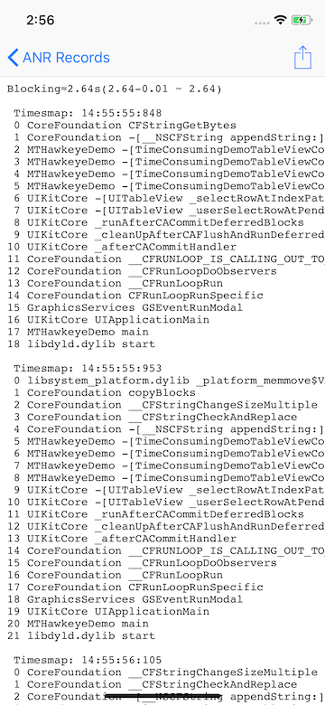

# Hawkeye - ANR Trace

`ANR Trace` is used to capture the main thread stalling event, and will sampling the main thread stack frame when the jam occurs.

## 0x00 Usage

After add `ANR Trace` to `MTHawkeyeClient`, by default it'll start after `MTHawkeyeClient` run, you can change it by following steps:

1. Tap MTHawkeye floating window, enter the main panel.
2. Tap navigation title view, show the MTHawkeye panel switching view.
3. Tap `Setting` in the upper right corner of the switching view, enter the Setting view home.
4. Find `TimeConsuming` and go to `ANR Trace`, turn off `Trace ANR`, configure `ANR Threshold`

## 0x01 Record stalling event

When a method executed on main thread takes longer than the specified threshold (the default is 400ms), `ANR Trace` will capture a stalling event, and sampling the stack frame of main thread. You can see the recorded stalling events and details within the App while development.

 

If you need a accurate duration time while stalling and the detail calls, consider using [UI Time Profiler](./ui-time-profiler.md)

## 0x02 Hard stall event

When the app run into hard stall, it may killed without any logs, you can use `MTHANRTracingBuffer` to cache and restore the last running context.


## 0x03 Storage

ANR records is store under [Records file](./../hawkeye-storage.md#0x02-built-in-plugin-data-storage-instructions). Use a `collection` name `anr`, `key` as the time stalling event generated, `value` is a JSON string with the following fields:

- `duration`: stalling duration, in millisecond
- `stacks`: all stack frame during stalling event 
- `titleframe`: stall event stack title string
- `time`: the time stalling event generated
- `stackframes`: sampling stack frame when the stalling event captured (symbolic needed), hexadecimal address string separated by `,`

examples:

```json

{
    duration = "7352.797031402588";
    stacks = [
        {
            stackframes = 0x10d1f64ae;
            time = "1561618437.344688";
            titleframe = 0x10d1f64ae;
        },
        {
            stackframes = "0x10d1f5b1f,0x10d1efe7f,0x10d19c407,0x107203a1e,0x107203717,0x1072031dd,0x107203119,0x11545e418,0x11545e62c,0x11524ecc8,0x11523e198,0x11526b32a,0x10d1b80f6,0x10d1b25bd,0x10d1b2c30,0x10d1b2301,0x10ecf02fd,0x115243ba1,0x10720e2e1,0x10d877540";
            time = "1561618437.448422";
            titleframe = 0x107203a1e;
        },
        {
            stackframes = "0x10d1efc16,0x10d19c407,0x107203a1e,0x107203717,0x1072031dd,0x107203119,0x11545e418,0x11545e62c,0x11524ecc8,0x11523e198,0x11526b32a,0x10d1b80f6,0x10d1b25bd,0x10d1b2c30,0x10d1b2301,0x10ecf02fd,0x115243ba1,0x10720e2e1,0x10d877540";
            time = "1561618437.601369";
            titleframe = 0x107203a1e;
        },
        {
            stackframes = "0x10bd64660,0x107203717,0x1072031dd,0x107203119,0x11545e418,0x11545e62c,0x11524ecc8,0x11523e198,0x11526b32a,0x10d1b80f6,0x10d1b25bd,0x10d1b2c30,0x10d1b2301,0x10ecf02fd,0x115243ba1,0x10720e2e1,0x10d877540";
            time = "1561618437.803538";
            titleframe = 0x107203717;
        },
        {
            stackframes = "0x1072039e9,0x107203717,0x1072031dd,0x107203119,0x11545e418,0x11545e62c,0x11524ecc8,0x11523e198,0x11526b32a,0x10d1b80f6,0x10d1b25bd,0x10d1b2c30,0x10d1b2301,0x10ecf02fd,0x115243ba1,0x10720e2e1,0x10d877540";
            time = "1561618438.056277";
            titleframe = 0x1072039e9;
        },
                {
            stackframes = "0x10dbd8ce4,0x10d1e0853,0x10d1efedd,0x10d19c407,0x107203a1e,0x107203717,0x1072031dd,0x107203119,0x11545e418,0x11545e62c,0x11524ecc8,0x11523e198,0x11526b32a,0x10d1b80f6,0x10d1b25bd,0x10d1b2c30,0x10d1b2301,0x10ecf02fd,0x115243ba1,0x10720e2e1,0x10d877540";
            time = "1561618438.359641";
            titleframe = 0x107203a1e;
        }
    ]
}
```

## 0x03 Symbolics

`ANR Trace` records raw stack frame need to symbolized for reading.

If the running App do have DWARF within, you can directly use `ANR Trace` panel to view the symbolized result generated internal.

In other cases, if you have your own [remote symbolization service](./../hawkeye-remote-symbolics.md) and did set, switch on the `Remote Symbolics`, and then you can view the symbolized stack frame directly in the App.

If you wanna get the raw data from the sandbox, manual symbolize yourself as follows:

1. Get the `dyld-images` file in the MTHawkeye storage directory.
2. Get the raw stack frame data from the records.
3. Get the `dSYM` files
4. for each `frame`
    - find the match `dyld-image` by `frame` value, then match a `dSYM` file.
    - Use `atos` command to symbolize the `frame`.
