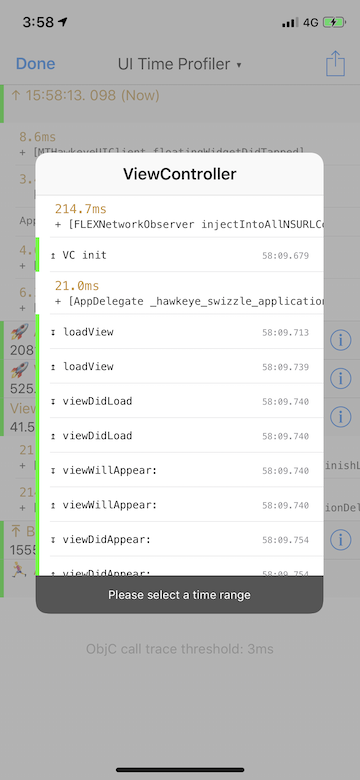
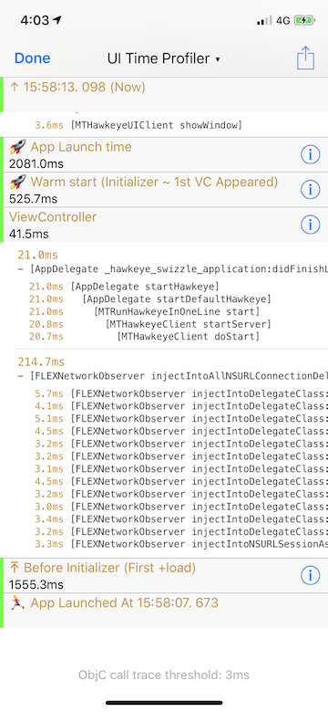
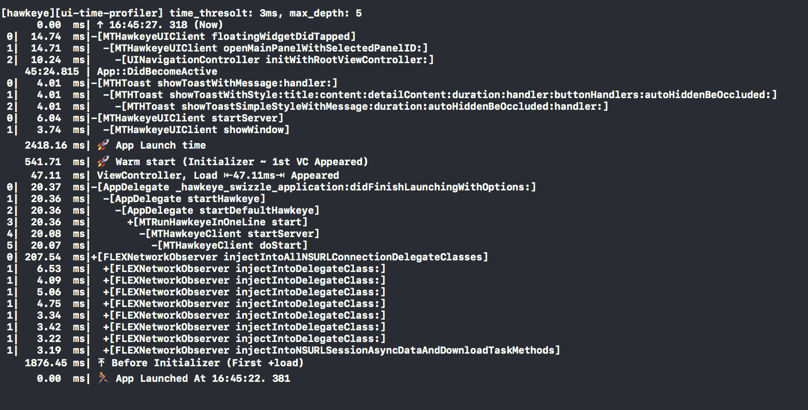

# Hawkeye - UI Time Profiler

`UI Time Profile` 用于辅助主线程耗时任务的优化，包括不限于启动、页面打开、关键操作流程。

## 0x00 背景

日常开发中，我们在分析应用的耗时性能，如启动耗时，页面打开耗时。我们常用的方式有几种：

1. 使用 Instrument Time Profiler。但结果可能不是很准确，比如如果在主线程误使用同步网络请求方法，在 time profiler 中只会记录为几毫秒的调用耗时，而实际卡住主线程的时间会耗时上百毫秒。同时因为 time profiler 最终的展示形式局限性，要直观的展示页面加载的整体耗时还是不太方便。

2. 使用第三方库，如 [BLStopwatch](https://github.com/beiliao-mobile/BLStopwatch), 能比较简单的在代码中插入锚点，然后在某一时期显示锚点间的耗时结果。但这一部分代码需要特殊处理才能进入到仓库中以便不影响主开发流程，不会对线上代码造成影响。

3. 使用 [Instrument System Trace](https://developer.apple.com/videos/play/wwdc2016/411/) 来分析详细的耗时。这是一个终极的分析方法，适合于在精细的分析时使用。

有些场景下，我们需要不能很便利的使用以上工具，同时也没办法满足自动化跟踪的要求，这时我们需要一个更方便的工具来帮忙我们跟踪耗时情况，这就是 `UI Time Profiler` 所要做的事情。

## 0x01 使用

`UI Time Profiler` 模块分为两个部分，第一部分默认开启，主要用于跟踪启动、ViewController 显示的耗时。第二部分默认关闭，主要用于跟踪记录在主线成功执行耗时大于某个阈值的所有 `Objective-C` 方法。如果需要关闭或者开启可以按以下步骤：

1. 启动App后，点击 MTHawkeye 的浮窗进入主面板。
2. 点击导航栏 title，呼出 MTHawkeye 面板切换界面。
3. 点击切换界面右上角的 `Setting`，进入 MTHawkeye 设置主界面。
4. 找到 `TimeConsuming`, 进入`UI Time Profiler`。
    - `Trace VC Life` 开关跟踪启动整体耗时、ViewController 显示耗时
    - `Trace ObjC Call` 开关跟踪主线程执行的长耗时 `Objective-C` 方法（只支持真机)

除了这两个模块自动记录的耗时点之外，上层可以调用 API 插入自己的锚点，锚点也会在结果图中整合显示

```objc
[[MTHTimeIntervalRecorder shared] recordCustomEvent:@"web init"];

[[MTHTimeIntervalRecorder shared] recordCustomEvent:@"web request start" time:1555052516];

[[MTHTimeIntervalRecorder shared] recordCustomEvent:@"web did load" extra:@"{xxxxx}"];
```

## 0x02 交互说明

在监测记录展示界面分为三部分：

### UI Time Profiler 主界面

主界面以 section-rows 形式展示，按时间倒叙（缩进短、淡灰色背景为 section，缩进较长、白色背景为 row）。section 可能为启动流程的关键时间节点、或者视图控制器显示完成的时间点，section 下的 row 为两个 section 之间记录的所有数据，没有时间之外的关联。

section 说明，按时间倒序：

- `↑ %@ (Now)`: 打开监测记录查看页面的时间点
- ...
- `***ViewController`: 表示这个 ViewController 显示过程耗时
- ...
- `🚀 App Launch time`: App 进程创建到第一个视图控制器显示完成的耗时
- `🚀 Warm start (Initializer ~ 1st VC Appeared)`: MTHawkeye `+load` 到第一个视图控制器显示完成的耗时
- `⤒ Before Initializer (First +load)`: 从进程创建到 MTHawkeye `+load` 被初始化的耗时
- `🏃 App Launched At`: App 进程的创建时间点

App 生命周期记录点说明

- `App::WillEnterForeground`: `UIApplicationWillEnterForegroundNotification` 时间点
- `App::DidBecomeActive`:  `UIApplicationDidBecomeActiveNotification` 时间点
- `App::DidEnterBackground`: `UIApplicationDidEnterBackgroundNotification` 时间点


> 上图中 ViewController 41.5ms 表示 ViewController 显示的过程耗时为 41.5ms，点开右侧可以看各阶段详情。
>
> 下方的包含了两个 row，分别为 21ms 和 214.7ms，他们在 ViewController 的显示完成时间点之前发生，并不一定发生在显示过程之内。

### 启动耗时详情/页面显示耗时详情界面

对于启动记录和页面显示耗时记录 section，点击右侧 detail 标识可查看详情，字段说明：

- `AppDidLaunch Enter`：`application:didFinishLaunchingWithOptions` 进入时间点
- `AppDidLaunch Exit`：`application:didFinishLaunchingWithOptions` 退出时间点
- `↥ VC init`: 该视图控制器的创建结束时间点
- `↧ loadView` & `↥ loadView`: 该视图控制器 loadView 进入和退出时间点
- `↧ viewDidLoad` & `↥ viewDidLoad`: 该视图控制器 viewDidLoad 的进入和退出时间点
- `↧ viewWillAppear:` & `↥ viewWillAppear:`: 该视图控制器 viewWillAppear 的进入和退出时间点
- `↧ viewDidAppear:` & `↥ viewDidAppear:`: 该视图控制器 viewDidAppear 的进入和退出时间点

示例：
 

### 主线程长耗时的 ObjC 方法记录

当开启 `Trace Objc Call` 后，可获取到主线程哪些 ObjC 方法执行耗时较长（默认统计超过10ms的方法）。



### 导出数据

如果数据过多，可直接点击 `UI Time Profiler` 模块主界面**右上角按钮**，输入日志到 Xcode 控制台，并且可通过 AirDrop 分享。



## 0x03 存储说明

插件接入到 MTHawkeyeClient 之后，如果有产生数据，会记录到 [Records 文件](./../hawkeye-storage-cn.md#0x02-内置插件存储数据说明)，包含以下几种类型的数据

### 启动耗时信息

启动期间的几个时间节点信息会以名为 `app-launch` 的 `collection`， `key`为 "0"，`value` 为 json 字符串，json 各个字段说明如下：

```json
{
  "appLaunchTime" : 1533019689.050308,             // App 启动的时间
  "firstObjcLoadStartTime": 1533019689.050308,     // MTHawkeye +load 被加载的时间点（做一定处理可以使 MTHawkeye load 第一个被加载）
  "lastObjcLoadEndTime": 1533019689.050308,        // 最后一个 load 被加载的时间点，暂无
  "staticInitializerStartTime": 1533019689.050308, // C++ 静态变量初始化开始时间点，暂无
  "staticInitializerEndTime": 1533019689.050308,   // C++ 静态变量初始化结束时间点，暂无
  "applicationInitTime" : 1533019694.4675779,      // UIApplication 开始创建（init）的时间
  "appDidLaunchEnterTime" : 1533019695.0537369,    // 进入 application:didFinishLaunchingWithOptions: 的时间
  "appDidLaunchExitTime" : 1533019695.082288       // application:didFinishLaunchingWithOptions: 方法 return 的时间
}
```

### ViewController 打开耗时信息

每个视图控制器打开后，会产生一条记录，`collection` 为 `view-ctrl`，key 为 VC didAppeared 结束的时间点，value 为 json 字符串，字段示例如下：

```json
{
  "initExitTime" : 1533018427.0977719,           // VC 的 -init 方法 return 的时间，可能为 0（同个 VC 多次打开）
  "loadViewEnter" : 1533018427.1496551,          // VC 的 -loadView 方法被调用的时间（开始加载视图），可能为 0
  "loadViewTime" : 1533018427.155427,            // VC 的 -loadView 方法 return 的时间，可能为 0
  "didLoadEnter" : 1533018427.1554639,           // VC 的 -viewDidLoad 方法被调用的时间，可能为 0
  "didLoadTime" : 1533018427.1662569,            // VC 的 -viewDidLoad 方法 return 的时间，可能为 0
  "willAppearEnter" : 1533018427.166456,         // VC 的 -viewWillAppear: 方法被调用的时间
  "willAppearTime" : 1533018427.166533,          // VC 的 -viewWillAppear: 方法 return 的时间
  "didAppearEnter" : 1533018427.194926,          // VC 的 -viewDidAppear: 方法被调用的时间
  "didAppearTime" : 1533018427.195226,           // VC 的 -viewDidAppear: 方法 return 的时间（页面展示完成）
  "name" : "FacebookProjectsTableViewController" // 视图控制器的名称
}
```

### 自定义的事件

自定义事件存储时使用名为 `custom-time-event` 的 `collection`，key 为记录时间点，value 为 json 字符串，字段示例如下：

```json
{
  "time": 1533018427.0977719,       // 事件记录的时间点
  "event": "event name",            // 事件的 event 名称，参考 [[MTHTimeIntervalRecorder shared] recordCustomEvent:event extra:extra];
  "extra": "event extra info"       // 事件的补充信息
}
```

插件内包含了三个内置的自定义事件：

- `App::WillEnterForeground`
- `App::DidEnterBackground`
- `App::DidBecomeActive`

### 主线程 Objective-C 方法调用耗时信息

记录到的耗时超过指定阈值的主线程方法，`collection` 为 `call-trace`，`key` 为递增下标，从 0 开始，每一条记录对应一个方法调用耗时， `value` 为一个 json string，以下为示例

```json
{
  "class": "MTHawkeyeClient",  // 调用的方法所在类类名
  "method": "start",           // 调用的方法方法名
  "cost": "135.02",            // 方法执行耗时, 单位为 ms
  "time": "1510970411.322888", // 方法执行完成 unix 时间, 单位为 s
  "depth: "0"                  // 方法的调用层级, 从 0 开始
}
```

因为记录的方法列表为同一线程串行执行，取出列表后按时间排序，可以根据 depth 生成子方法调用树，打印成以下格式更直观的展示

```sh
 0| 178.33  ms|-[ClassAAA] applyCurrentFilterEffectShowTips:]
 1| 135.02  ms|  -[NSKVONotifying_xxxxx xxxxxx]
 2| 135.01  ms|    -[NSKVONotifying_xxxxx startXZx]
 3| 134.95  ms|      -[AVCaptureSession startRunning]
 0|  56.61  ms|-[XXXXYrManager setxxxxxx:]
 0| 451.25  ms|-[_UIViewControllerOneToOneTransitionContext completeTransition:]
 1| 430.78  ms|  -[ClassAAA configureXXXXXAnimation:]
 2| 412.83  ms|    -[ClassAAA xxxxxhowRect:preViewSize:]
 3| 412.60  ms|      -[ClassAAA xxxxProcessTool]
 0| 195.64  ms|-[UIView layoutIfNeeded]
 0|  64.24  ms|-[ClassAAA setupXXX]
 0|  70.74  ms|-[ClassAAA setupSubviews]
```